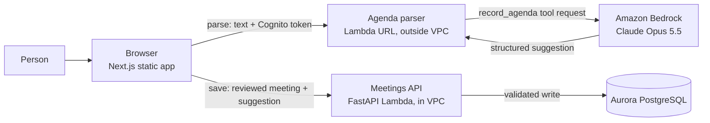

# SuccessfulSuccess container view (C4 level 2)

```mermaid
flowchart LR
  person[Person]
  browser[Browser\nNext.js static app]
  parser[Agenda parser\nLambda URL, outside VPC]
  bedrock[Amazon Bedrock\nClaude Opus 5.5]
  api[Meetings API\nFastAPI Lambda, in VPC]
  db[(Aurora PostgreSQL)]
  person --> browser
  browser -->|parse: text + Cognito token| parser
  parser -->|record_agenda tool request| bedrock
  bedrock -->|structured suggestion| parser
  browser -->|save: reviewed meeting + suggestion| api
  api -->|validated write| db
```

The parser only returns a suggestion; the browser submits reviewed fields to
the existing authenticated API. The parser does not connect to Aurora.
